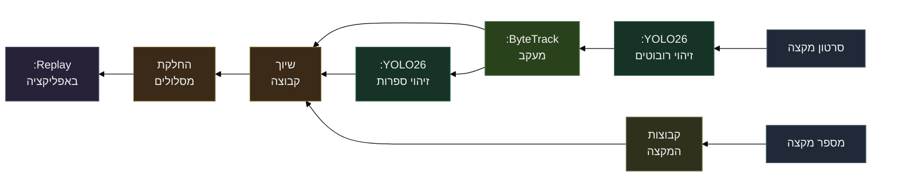

---
layout: cover

background: background.png
class: rtl cover-slide
transition: slide-left
---

# AutoScout&rlm;

מערכת מעקב אוטומטית לרובוטים בתחרויות <bdi>FRC</bdi>&rlm;

<!--
AutoScout היא מערכת שמקבלת סרטון מקצה FRC ומספר מקצה, ומחזירה מסלולים של רובוטים שמשויכים לקבוצות.
-->

---
layout: default
class: rtl demo-slide
transition: slide-up
---

# הדגמה

מתחילים עיבוד על קליפ קצר

<!--
אני מתחיל את העיבוד כבר עכשיו, כי הוא עובר על הרבה פריימים ולוקח זמן על הלפטופ.
בזמן שהוא רץ, אני אחזור למצגת ואסביר מה המערכת פותרת ואיך היא עובדת.
כאן לצאת מהמצגת, להעלות קליפ קצר, לבחור מספר מקצה, להתחיל עיבוד, ולחזור למצגת.
-->

---
layout: default
class: rtl
transition: slide-left
---

# הבעיה

סקאוטינג ידני דורש הרבה כוח אדם.

קשה לעקוב אחרי שישה רובוטים במקביל.

חסרים מסלולים מלאים לאורך זמן.

<!--
בסקאוטינג ידני קשה לעקוב אחרי שישה רובוטים במקביל, במיוחד כשיש תנועה מהירה וחסימות.
בנוסף, בדרך כלל מקבלים אירועים או הערכות, אבל לא מסלול מלא של כל רובוט לאורך זמן.
-->

---
layout: default
class: rtl pipeline-slide
transition: slide-left
---

# הפתרון

<!--
הנקודה המרכזית היא ש-track ID הוא לא team ID.
ByteTrack יכול להגיד לי שזה אותו אובייקט לאורך כמה פריימים, אבל הוא לא יודע איזו קבוצה זו.
בשביל להפוך עקבה זמנית לקבוצה אמיתית, צריך לזהות ספרות, להשוות לקבוצות האפשריות במקצה, ולצבור החלטות לאורך זמן.
-->

---
layout: default
class: rtl
transition: slide-left
---

# דאטה ומודלים

<h3>רובוטים ובריתות</h3>

זיהוי רובוטים,

סיווג בריתות,

מסגרות גדולות יחסית.

<h3>ספרות</h3>

זיהוי ספרות בודדות,

חיתוכי באמפרים,

הכללה לקבוצות חדשות.

<!--
אימנתי שני מודלי YOLO שונים: אחד לזיהוי רובוטים ובריתות, ואחד לזיהוי ספרות.
את הספרות זיהיתי כספרות בודדות ולא כמספרי קבוצות שלמים, כדי שהמערכת תוכל להתמודד גם עם קבוצות שלא הופיעו באימון.
-->

---
layout: default
class: rtl
transition: slide-left
---

# אימון והערכה

<h3>חלוקה</h3>

Train&rlm; / Validation&rlm; / Test&rlm;

<h3>מדדים</h3>

Precision&rlm; / Recall&rlm; / mAP&rlm;

<h3>בדיקה מלאה</h3>

End-to-end&rlm;
מסלולים משויכים

<!--
הערכתי את המודלים במדדים רגילים של זיהוי אובייקטים.
אבל בפרויקט הזה חשוב גם לבדוק האם המערכת המלאה מצליחה להפיק מסלולים משויכים לקבוצות.
-->

---
layout: default
class: rtl
transition: slide-left
---

# התוצאות

מודל הרובוטים יציב יותר.

מודל הספרות רגיש יותר.

המדד החשוב הוא הצלחת השיוך לאורך זמן.

<!--
מודל הרובוטים יציב יותר, כי הרובוטים גדולים וברורים יחסית.
מודל הספרות קשה יותר, כי הספרות קטנות, מטושטשות ולעיתים מוסתרות.
לכן לא מספיק להסתכל רק על מדד של מודל בודד, אלא גם על התוצאה הסופית של המערכת.
-->

---
layout: default
class: rtl
---

# מגבלות

<h3>הסתרות</h3>

רובוטים מסתירים אחד את השני.

<h3>טשטוש</h3>

תנועה מהירה ואיכות צילום.

<h3>איבוד מעקב</h3>

קשה לזהות מחדש אחרי איבוד עקבה.

<!--
המערכת לא מושלמת.
הכשלים העיקריים הם חסימות, טשטוש, וזיהוי מחדש אחרי איבוד track.
אם הייתי ממשיך את הפרויקט, הייתי משפר Re-ID וזיהוי ספרות בתנאי צילום קשים.
-->

---
layout: default
class: rtl demo-slide
transition: slide-down
---

# חזרה לדמו

<bdi>Replay</bdi>&rlm; עם מסלולים משויכים

<!--
עכשיו נחזור למערכת ונראה את הפלט הסופי.
כאן רואים שהמערכת לא רק מזהה רובוטים בפריים בודד, אלא מפיקה מסלולים לאורך זמן ומשייכת אותם לקבוצות.
זה המידע שבאמת שימושי לסקאוטינג.
-->

---
layout: default
class: rtl
---

# סיכום

<h3>Computer Vision&rlm;</h3>

זיהוי רובוטים וספרות.

<h3>Tracking&rlm;</h3>

מעקב לאורך זמן.

<h3>System Design&rlm;</h3>

מערכת מקצה לקצה.

<!--
הדבר המרכזי שלמדתי הוא שהאתגר לא היה רק לאמן מודל, אלא לחבר כמה רכיבים למערכת אחת:
זיהוי רובוטים, מעקב, זיהוי ספרות, לוגיקת שיוך, החלקה והצגה באפליקציה.
-->
